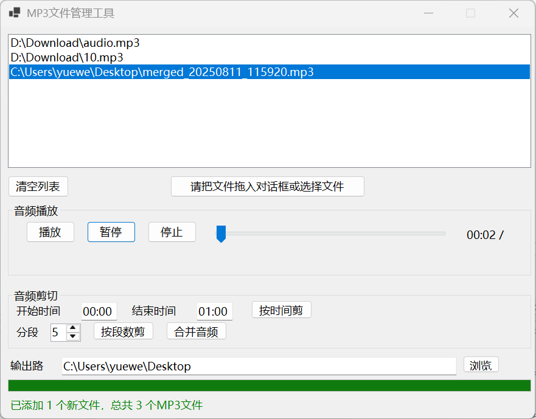

# 🎵 MP3Cut - 简单易用的MP3剪切合并工具

<p align="center">
  
</p>

<p align="center">
  <a href="#-下载">下载</a> •
  <a href="#-功能特性">功能</a> •
  <a href="#-使用方法">使用</a> •
  <a href="#-打赏支持">打赏</a>
</p>

## ✨ 功能特性

| 功能 | 描述 |
|------|------|
| 🎯 **拖拽添加** | 支持拖拽MP3文件到软件界面 |
| ✂️ **按时间剪切** | 指定开始和结束时间进行精确剪切 |
| 📊 **按段数剪切** | 将音频平均分割成指定段数 |
| 🔗 **音频合并** | 将多个MP3文件合并成一个文件 |
| 🎨 **简洁界面** | 直观的WinForms用户界面 |

## 💻 系统要求

- **操作系统**: Windows 10 或更高版本
- **运行时**: .NET 6.0 Runtime
- **依赖**: [NAudio](https://github.com/naudio/NAudio) 音频处理库

## 🚀 快速开始

### 1. 克隆项目
```bash
git clone https://github.com/dickwin2003/mp3cut.git
cd mp3cut
```

### 2. 安装依赖
```bash
dotnet restore
```

### 3. 编译运行
```bash
dotnet build
dotnet run
```

### 4. 或直接下载
从 [Releases](https://github.com/dickwin2003/mp3cut/releases) 页面下载预编译版本

## 📖 详细使用指南

### 📁 添加文件
- **拖拽添加**: 将MP3文件拖拽到软件窗口
- **支持多选**: 可同时添加多个文件
- **文件预览**: 在列表中查看已添加的文件

### ✂️ 按时间剪切
1. 在文件列表中选择一个MP3文件
2. 输入开始时间和结束时间（格式：`mm:ss`）
3. 点击 **"按时间剪切"** 按钮

**示例**: 剪切从 01:30 到 03:45 的片段
- 开始时间: `01:30`
- 结束时间: `03:45`

### 📊 按段数剪切
1. 在文件列表中选择一个MP3文件
2. 设置要分割的段数（1-100）
3. 点击 **"按段数剪切"** 按钮

### 🔗 音频合并
1. 添加多个MP3文件到列表（至少2个）
2. 调整文件顺序（如果需要）
3. 点击 **"合并音频"** 按钮

### 📂 输出设置
- **默认路径**: 桌面
- **自定义路径**: 点击 **"浏览"** 选择文件夹

## 📁 输出文件命名

| 操作类型 | 命名格式 | 示例 |
|----------|----------|------|
| 按时间剪切 | `原文件名_cut_开始时间_to_结束时间.mp3` | `music_cut_01-30_to_03-45.mp3` |
| 按段数剪切 | `原文件名_segment_段号.mp3` | `music_segment_01.mp3` |
| 音频合并 | `merged_时间戳.mp3` | `merged_20240115_143022.mp3` |

## 🛠️ 技术栈

- **语言**: C# (.NET 6.0)
- **框架**: Windows Forms
- **音频处理**: [NAudio](https://github.com/naudio/NAudio)
- **MP3编码**: [NAudio.Lame](https://github.com/Corey-M/NAudio.Lame)

## ⚠️ 注意事项

- ✅ 确保系统已安装LAME编码器以支持MP3输出
- ⏳ 处理大文件时可能需要较长时间，请耐心等待
- 💾 建议在处理前备份原始音频文件
- 🔄 支持批量处理多个文件

## 🤝 贡献指南

欢迎提交 Issue 和 Pull Request！

1. Fork 本项目
2. 创建功能分支 (`git checkout -b feature/AmazingFeature`)
3. 提交更改 (`git commit -m 'Add some AmazingFeature'`)
4. 推送到分支 (`git push origin feature/AmazingFeature`)
5. 开启 Pull Request

## 💝 打赏支持

如果这个工具对你有帮助，可以请我喝杯咖啡 ☕

<div align="center">
  
| 微信打赏 | 支付宝打赏 |
|:--------:|:----------:|
|  |  |
  
  **感谢您的支持！** ❤️
  
</div>

## 📄 许可证

本项目采用 MIT 许可证 - 查看 [LICENSE](LICENSE) 文件了解详情

## 🌟 Star 历史

[](https://star-history.com/#dickwin2003/mp3cut&Date)

---

<div align="center">

**Made with ❤️ by [dickwin2003](https://github.com/dickwin2003)**

</div>